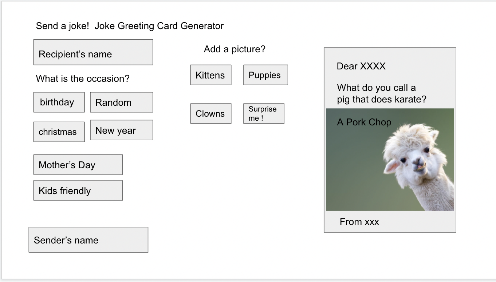
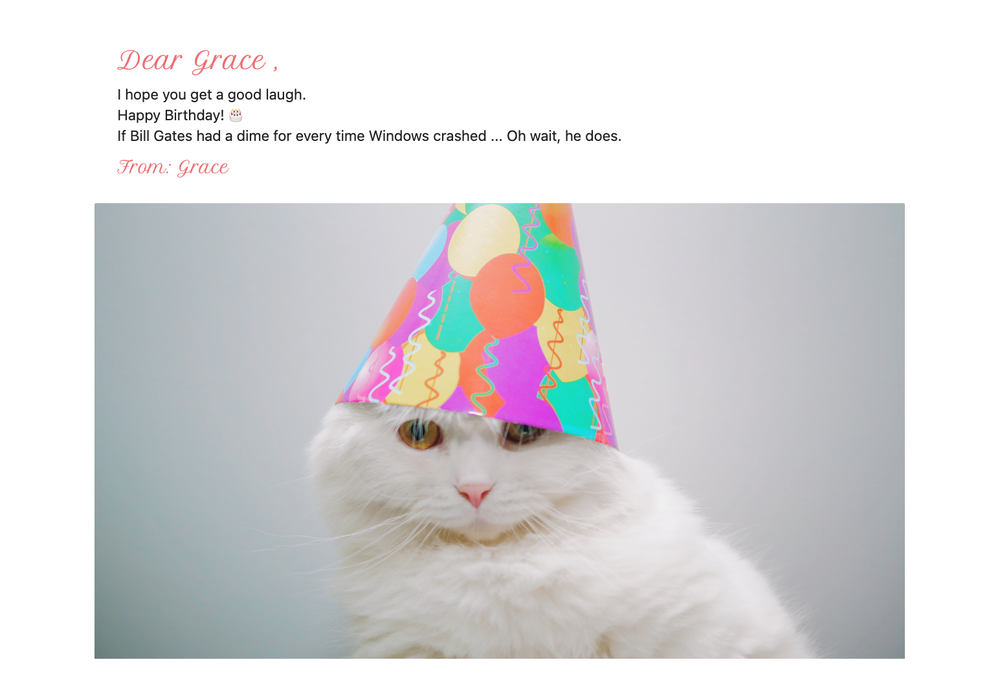

# project-01-send-a-joke

## User Story

```
As a fun person
I WANT to make a greeting card with a joke and a cute picture on it
SO THAT I can get a good laugh and send it to my friend
```

## Acceptance Criteria
```
GIVEN I am using a card generator
WHEN I open the app on my phone or my computer
THEN I am asked to enter the recipient's and the sender's name
WHEN I enter the names
THEN I can preview that they look like in the card
WHEN I scroll down
THEN I can choose what occasion (if any) this card is for and what kind of pictures I want include in the card
WHEN I go through jokes
THEN I see a joke history and I can bring back the joke when I click on it.
WHEN I am finished my selections
THEN I am presented with a greeting card with a joke and a picture on it
WHEN I view the card
THEN I get a good laugh and I can save it and send it to my friend
WHEN I want to re-open the app to send another card
THEN I see the last joke saved on the card
```

## Built with
* HTML
* CSS
* JavaScript

## Third Party Libraries
* JQuery
* MaterializeCSS
* html2canvas

## Website
https://mavisyupyup1.github.io/project-01-send-a-joke/

## Wire framing


## MVP Demo


## Version 1.0 Demo


## Version 2.0 Demo


## Sample card
